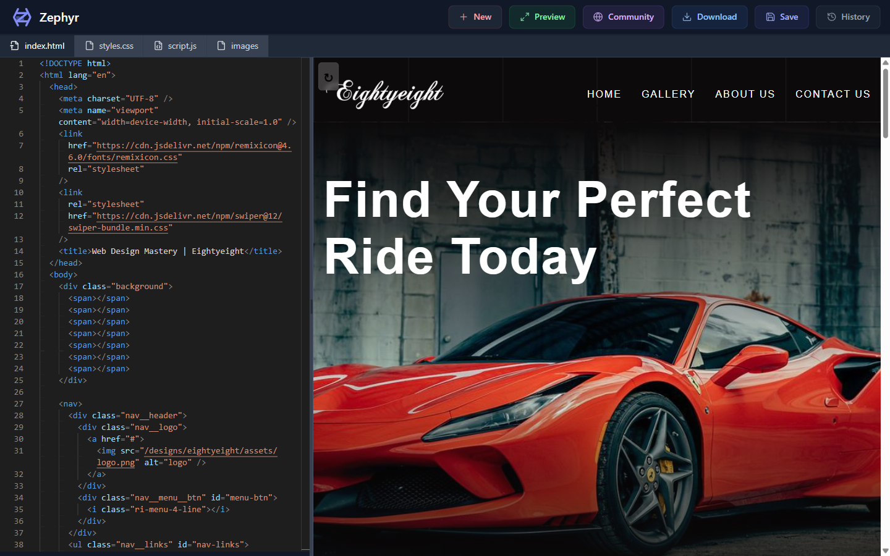
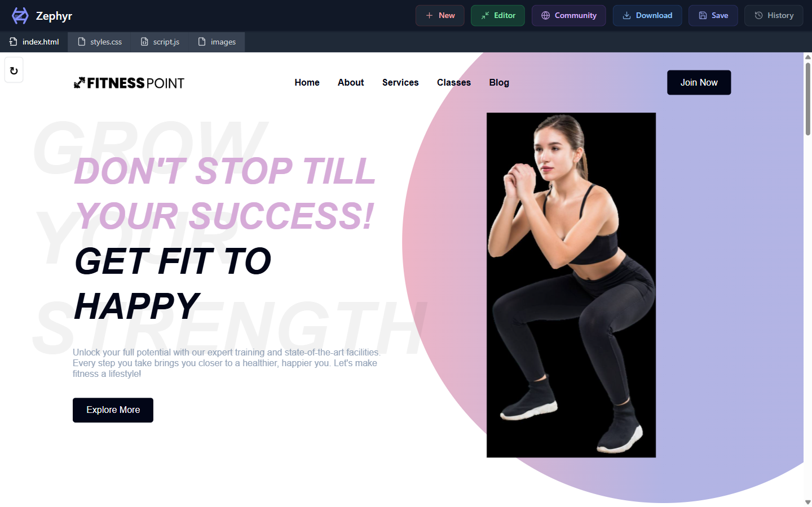
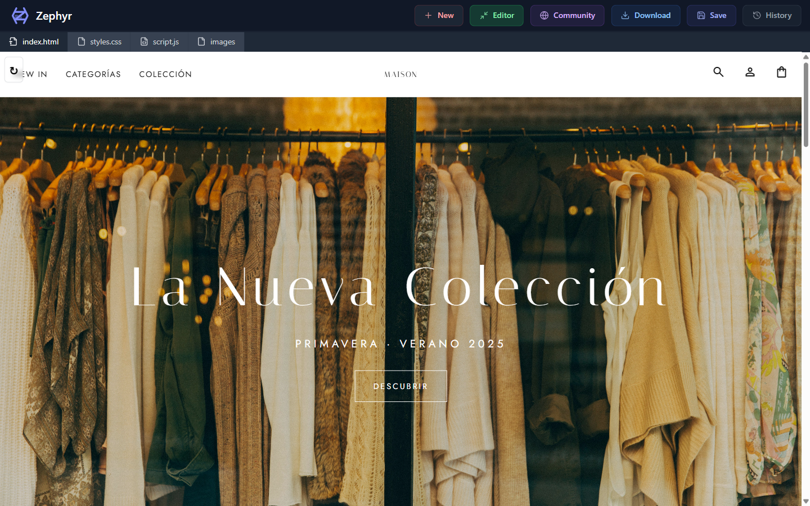

<div align="center">

# **Zephyr**

### *Crea páginas web viendo el resultado al instante*

[](https://react.dev)
[](https://www.typescriptlang.org)
[](https://vite.dev)
[](https://tailwindcss.com)
[](https://microsoft.github.io/monaco-editor/)
[]()

</div>

---

**Zephyr es un editor de páginas web que te enseña el resultado mientras escribes.**
Eliges un diseño ya hecho (o empiezas de cero), tocas el código y la página se
actualiza sola, en vivo. Cuando te gusta lo que ves, lo guardas o lo descargas.
Sin configuraciones raras y sin saber programar para empezar a trastear.



## Lo que la gente crea con Zephyr

| | |
|---|---|
|  |  |
| **Alquiler de coches** — página completa con galería de fotos, servicios y contacto. | **Gimnasio** — web moderna con clases, entrenadores y horarios. |
|  |  |
| **Tienda de moda** — escaparate elegante con colección de temporada. | **Formulario de registro** — página de alta de usuarios, lista para adaptar. |

## Usarlo es así de fácil

1. **Elige.** Abre *Community* y escoge un diseño que te guste, o pulsa *New* para
   empezar con una página en blanco.
2. **Toca y mira.** Escribe en las pestañas *HTML*, *CSS* o *JavaScript* y el
   resultado aparece al momento a la derecha. ¿Quieres verlo a lo grande? Pulsa
   *Preview*.
3. **Guárdalo o llévatelo.** Con *Save* lo guardas en tu navegador (y lo marcas
   como favorito si quieres). Con *Download* te lo descargas en un ZIP con todo
   dentro, listo para publicar donde quieras.

## Qué sabe hacer, en palabras normales

- **Editor con vista previa en vivo** — lo que cambias se ve al segundo.
- **Galería de diseños** — empieza desde algo bonito en vez de desde cero.
- **Guardar, favoritos e historial** — tu trabajo se queda guardado en tu propio
  navegador, nada sale fuera sin que tú lo decidas.
- **Sube tus fotos** — las arrastra al editor y él solo las ajusta de tamaño.
- **Descarga tu página** — te la llevas en ZIP (código + imágenes) o en imagen PNG.
- **Manual incluido** — la propia aplicación trae una guía de uso dentro.

## Ponerlo en marcha (2 minutos)

```bash
git clone https://github.com/cursospotiapp/livecode.git
cd livecode
npm install
npm run dev
```

Abre `http://localhost:5173` y listo.

## Con qué está hecho (para perfiles técnicos)

React + TypeScript + Vite, Tailwind CSS, editor Monaco (el de VS Code),
vista previa reactiva con debounce, persistencia local en IndexedDB,
descargas en ZIP (JSZip) y capturas con HTML2Canvas.

## Diseños incluidos y créditos

| Diseño | Qué es | Autoría |
|---|---|---|
| Registro de pacientes | Formulario de alta | Creado para este proyecto |
| Tienda de moda | Escaparate de ropa | Creado para este proyecto |
| Eightyeight · Alquiler de coches | Web de detailing y alquiler | Basado en el tutorial de [WebDesignMastery](https://github.com/WebDesignMastery/Eightyeight_15-09-25) ([canal](https://www.youtube.com/@WebDesignMastery)) |
| Fitness Point · Gimnasio | Web de gimnasio | Basado en el tutorial de [WebDesignMastery](https://github.com/WebDesignMastery/Fitness_Point_28-09-24) ([canal](https://www.youtube.com/@WebDesignMastery)) |

Los diseños de terceros se incluyen con fines educativos, con sus avisos de
copyright originales intactos (detalle completo en `CREDITS.md`). Las
fotografías son de bancos de imágenes libres (estilo Unsplash). El código de
la aplicación Zephyr es de mi autoría y se distribuye bajo licencia MIT
(ver `LICENSE`; los diseños de terceros quedan fuera de esa licencia).
